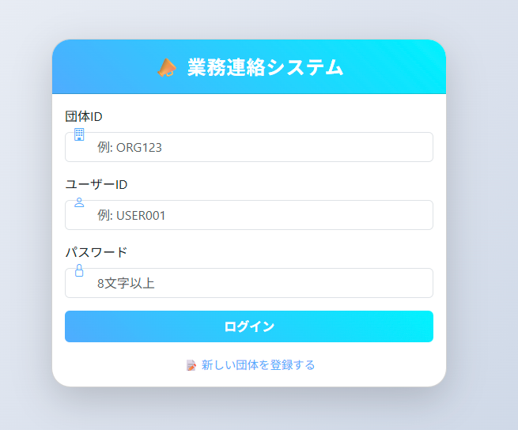
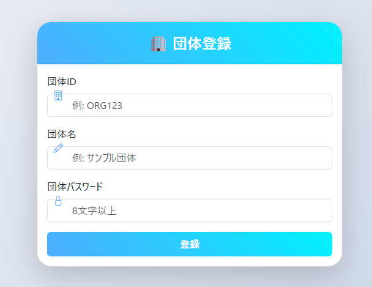
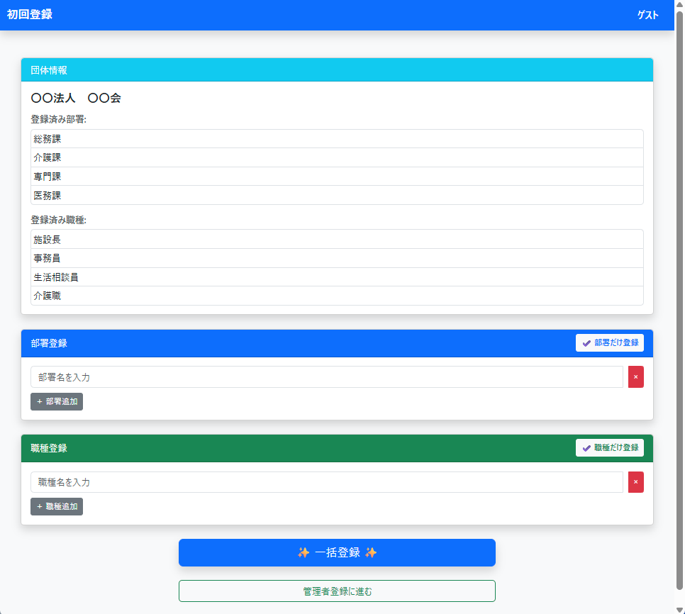
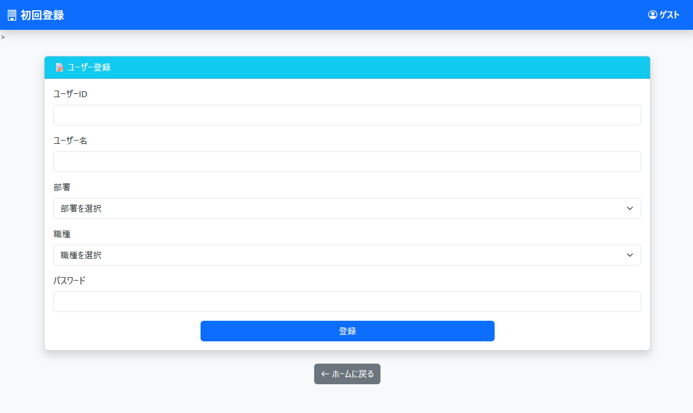
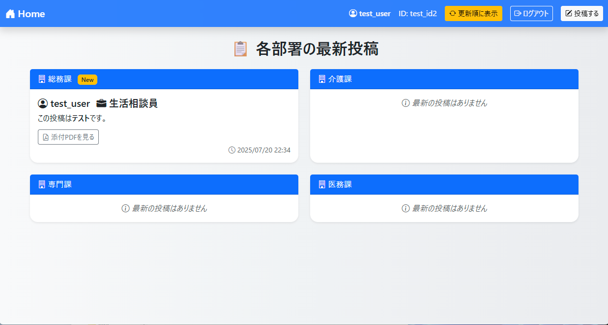
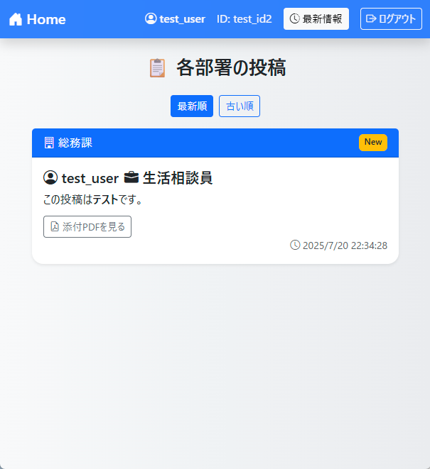
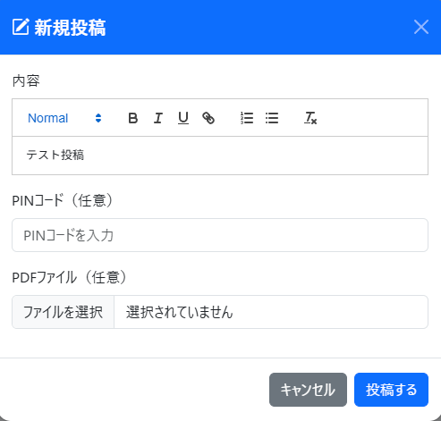
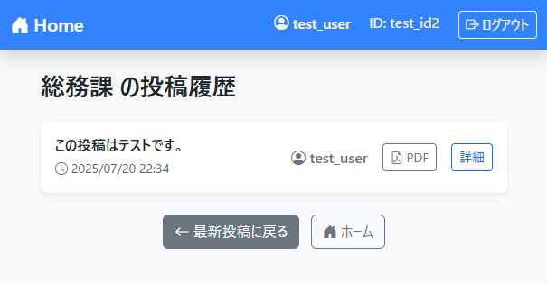
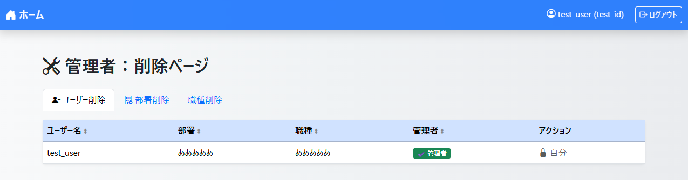

# 📝 業務連絡アプリ

## 📖 概要
このシステムは、部署ごとに最新情報を効率的に共有・管理できる社内業務連絡アプリです。
Spring Boot と Thymeleaf によりサーバーサイドを構築し、フロントエンドには React・Bootstrap5 を用いることで、シンプルかつレスポンシブなUIを実現しています。
開発には **生成AI (ChatGPT)** を活用し、コード生成・UI改良・API設計を行っています。
過去にExcel×VBAで作成した社内情報共有掲示板をWebアプリとしてリメイクしました。

---

## 🚀 主な機能
- ✅ ユーザー認証（ログイン／ログアウト機能）
- ✅ 部署ごとの投稿・最新情報表示（Spring Boot + Thymeleaf）
- ✅ 投稿履歴の一覧表示（履歴管理機能）
- ✅ リッチテキストによる投稿・編集・削除（Quill.js を使用）
- ✅ Reactによる投稿の並び替え表示（投稿順／最新順の切り替え）
- ✅ レスポンシブデザイン（Bootstrap5 によるモバイル対応）
- ✅ APIによるデータ取得（Axios を使用した非同期通信）

---

## 🛠 使用技術
- **バックエンド**: Spring Boot 3.x
- **フロントエンド**: 
  - Thymeleaf
  - React (TypeScript)
  - Bootstrap 5
- **データベース**: PostgreSQL
- **ビルドツール**: Maven
- **AI活用**: ChatGPT によるコード生成・設計支援
- **エディタ**: Eclipse　⇒　Visual Studio Code
- **API通信**: Axios

---

## デモURL
https://javaportfolio.onrender.com

## スクリーンショット
ログイン画面
- 団体ID、ユーザーID、パスワードを使用しログインを行います。
- 団体登録がまだであれば、先に団体登録を行います。


新規団体登録画面
- 団体ID、団体名、パスワードを入力し、団体登録を行います。
- 団体パスワードはまだ使用していませんが、部署・職種登録時に行う団体ログイン画面で使用する予定です。


部署・職種登録画面
- 部署・職種を登録する画面です。
- 管理者ユーザーのみHome画面からも遷移することが可能です。
- 団体情報ブロックには、団体名と、既に登録した部署名・職種名が表示されます。
- 部署(職種)追加を押下することで、複数の名称を一括登録することが可能です。
- 部署・職種単体でも登録が可能です。


ユーザー登録画面
- ユーザー登録を行います。
- 部署・職種は団体に紐づく登録情報をドロップダウン形式で選択可能です。
- 初回登録時は自動で管理者フラグが付与され、追加登録時はフラグ付加チェックボックスが表示されます。


Home画面
- ログイン後に表示される画面です。
- 各種登録画面への遷移ボタンは、管理者ユーザーのみ表示されます。


投稿内容表示画面
- 登録した部署が全て表示され、各部署からの最新投稿のみ表示されます。
- 当日更新時はNew、1日前なら１日前…とアイコンが付与されます。
- 添付したPDFをクリックすると、別タブでPDFが開きます。


更新順画面
- 投稿内容を、投稿された日付の降順で表示します。
- ※投稿は、最新情報側からのみとなっています。


投稿画面
- 最新情報画面の投稿するを押下時に、モーダルで開きます。
- Quilを使用したリッチテキストを投稿可能です。
- PDFを添付することが可能です。(最大1Mb制限あり）


投稿履歴画面
- 最新情報画面から、各部署のブロックを押下すると遷移する画面です。
- 各部署の投稿履歴が一覧で表示されます。表示される内容は、投稿内容の冒頭20文字です。
- 詳細をクリックすると、全文が表示され、編集・削除を選ぶことができます。


ユーザー削除画面
- 登録されているユーザー、部署、職種の削除ができます。
- 自分及び、ユーザーが所属している部署・職種の削除はできません。


## 💻 環境構築
 
1️⃣ クローン
```bash
git clone https://github.com/murasuke0613/WritingBord.git
cd demo

2️⃣ データベース設定
src/main/resources/application.properties を編集:

spring.datasource.url=jdbc:postgresql://<ホスト>:5432/<データベース名>
spring.datasource.username=<ユーザー名>
spring.datasource.password=<パスワード>
spring.datasource.hikari.data-source-properties.sslmode=require

spring.jpa.database-platform=org.hibernate.dialect.PostgreSQLDialect
spring.jpa.show-sql=true

3️⃣ Reactフロントエンド設定
cd frontend
npm install
開発モード起動

npm start
ブラウザで http://localhost:3000 を開きます。

本番ビルド
ReactをSpring Bootに統合する場合は以下を実行:

npm run build
生成された frontend/build の中身を
demo/src/main/resources/static/ にコピー。

4️⃣ Spring Bootサーバー起動
./mvnw clean package
java -jar target/demo-0.0.1-SNAPSHOT.jar
ブラウザで http://localhost:8080 を開きます。

## 💡 苦労した点と工夫
- **生成AIコードと整合性の確保**
  - ChatGPTで生成したコードと既存クラス間の整合性維持に苦戦し、頻発するマッピングエラーに対応。  
  - エラー内容を逐一確認し、原因の推測と改修を繰り返すことで問題箇所の特定と修正を実施。

- **DB・Web公開サーバー選定**
  - 無料で使用可能なサーバーを探し、Renderを選定。当初はMySQLで構築していたが、Renderでの無料枠が無いことが判明。  
  - PostgreSQLへの切り替えを決断し、SQL刷新と環境移行を実施。

- **技術スタックの大幅変更とリファクタリング**
  - 当初はサーブレット＋JSP構成で開発を進めていたが、PostgreSQL移行に合わせてSpring Boot + Maven + Reactへの全面刷新を決断。  
  - 3日間でリファクタリングを行い、モダンな構成への移行を完了。